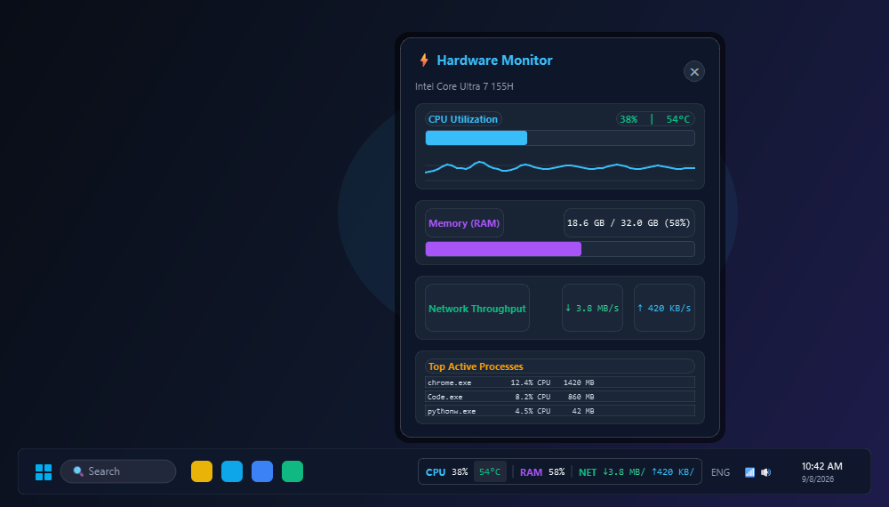
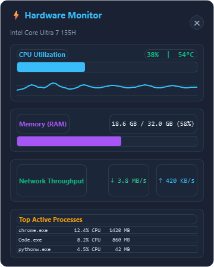

# Taskbar Hardware Monitor (Windows 10 / 11)

Aplikasi desktop modern yang ringan dan efisien untuk memantau performa sistem dan suhu hardware Windows secara real-time langsung dari Taskbar.

Dirancang khusus untuk laptop modern (seperti **Intel Core Ultra 7 155H**) dengan konsumsi memori sangat hemat (**< 45 MB RAM**) dan pemakaian CPU hampir 0%.

---

## Tampilan Antarmuka (Preview)

### 1. Tampilan Lengkap (Interactive Overview)


### 2. Mini Bar di Taskbar Windows 10 / 11
Mini bar frameless transparan yang menyatu elegan dengan taskbar Windows tanpa memakan tempat:


### 3. Flyout Dashboard (Popup Detail & Sparkline)
Klik mini bar atau ikon tray untuk membuka panel metrik detail, grafik riwayat CPU, dan proses teraktif:
<p align="center">
  
</p>

---

## Fitur Utama

- **Mini Taskbar Bar**: Strip horizontal frameless transparan yang menempel di taskbar, selalu terlihat di atas aplikasi lain (*Always on Top*).
- **Pemantauan 4 Metrik Inti Real-Time**:
  - ⚡ **CPU Usage (%)** & **CPU Temperature (°C)**
  - 🟣 **RAM Usage (%)** & Detail Kapasitas (GB terpakai / total GB)
  - 🟢 **Network Throughput (Download & Upload)** dengan satuan otomatis (KB/s, MB/s)
- **Flyout Dashboard Modern**: Klik mini bar atau tray icon untuk membuka pop-up card bergaya Fluent / Glassmorphism dengan grafik riwayat 60 detik (*sparkline graph*) dan 3 proses teratas yang mengonsumsi CPU terbesar.
- **Posisi Bebas (Drag & Drop)**: Geser widget ke posisi mana pun di taskbar atau layar sesuai selera, dilengkapi fitur **Lock Position** dan **Reset Posisi** di menu klik-kanan.
- **Indikator Warna Pintar**:
  - 🟢 **Normal (< 70°C)**: Hijau emerald
  - 🟡 **Peringatan (70°C - 85°C)**: Kuning amber
  - 🔴 **Tinggi (> 85°C)**: Merah
- **Auto-Run On Boot (Tanpa UAC Prompt)**: Terintegrasi dengan Windows Task Scheduler menggunakan hak akses tertinggi, sehingga otomatis aktif saat laptop menyala tanpa memunculkan dialog konfirmasi UAC yang mengganggu.
- **Graceful Fallback**: Jika dijalankan tanpa Administrator, aplikasi tetap memantau CPU, RAM, dan Network secara normal tanpa crash, dengan indikator status suhu membutuhkan izin admin.

---

## Cara Menjalankan

### 1. Menjalankan Langsung
Cukup klik dua kali file:
```text
run.bat
```
Aplikasi akan langsung berjalan di latar belakang (`pythonw.exe`) tanpa memunculkan jendela terminal hitam.

### 2. Mengaktifkan Auto-Run Saat Laptop Dinyalakan
- **Cara 1 (Rekomendasi)**: Klik kanan file `install-autorun.bat` lalu pilih **Run as administrator**.
- **Cara 2**: Klik kanan pada widget mini bar di taskbar atau ikon tray, lalu centang **Start on Windows Boot**.

Untuk mematikan auto-run, jalankan `uninstall-autorun.bat` atau hilangkan centang di menu aplikasi.

### 3. Mengompilasi Menjadi File `.exe` Mandiri (Opsional)
Jalankan:
```text
build_exe.bat
```
Script akan otomatis membuat file `TaskbarHardwareMonitor.exe` mandiri di dalam folder `dist/`.

---

## Struktur Proyek

```text
taskbar-hardware-monitor/
├── src/
│   ├── main.py              # Entry point aplikasi & single-instance manager
│   ├── sensor_manager.py    # Worker thread pengambil metrik (CPU, RAM, Net, Suhu)
│   ├── taskbar_widget.py    # Mini Bar transparan di atas taskbar
│   ├── flyout_dashboard.py  # Popup card detail dengan sparkline graph
│   ├── tray_manager.py      # Ikon system tray di dekat jam
│   ├── autorun_manager.py   # Pengelola Windows Task Scheduler
│   ├── config.py            # Manajemen konfigurasi & posisi tersimpan
│   └── utils.py             # Format kecepatan, byte, dan deteksi admin
├── assets/                  # Screenshot preview UI untuk dokumentasi
├── tests/                   # 18 Unit test otomatis
├── requirements.txt         # Daftar dependensi Python
├── run.bat                  # Script 1-klik menjalankan aplikasi
├── install-autorun.bat      # Script 1-klik pasang auto-start
├── uninstall-autorun.bat    # Script 1-klik lepas auto-start
└── build_exe.bat            # Script 1-klik compile ke .exe
```
