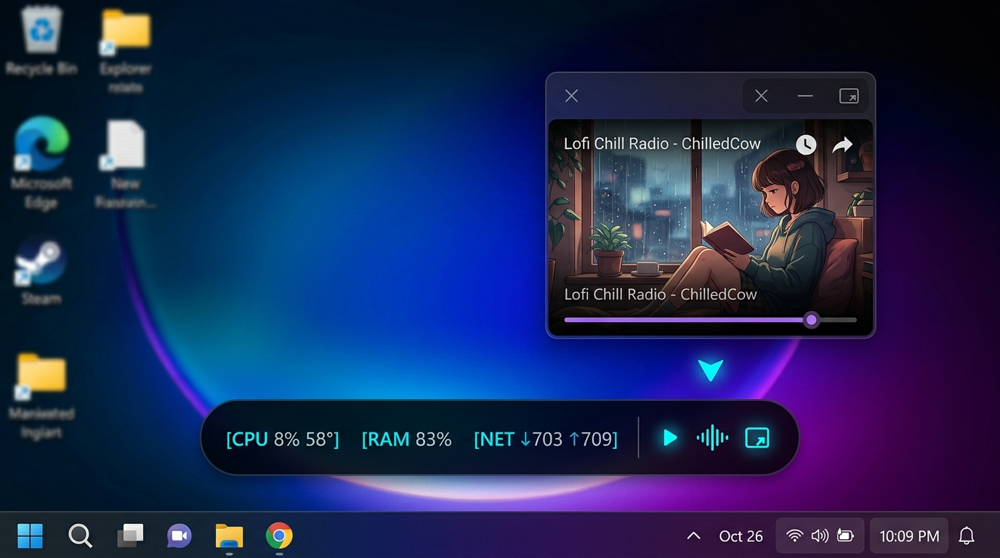
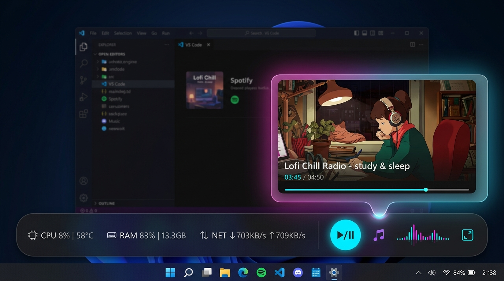

# Taskbar Hardware Monitor (Windows 10 / 11)

A sleek, modern, and lightweight Windows desktop application designed to monitor real-time system performance and hardware temperatures directly from your Taskbar.

Optimized specifically for modern laptops and workstations (e.g. **Intel Core Ultra 7 155H**) with ultra-low memory footprint (**< 45 MB RAM**) and near-zero CPU usage.

---

## User Interface Preview

### 1. Interactive Overview with Floating YouTube PiP
Docked seamlessly into the Windows taskbar with hardware metrics and an integrated YouTube Mini-Player and floating Picture-in-Picture window:


### 2. Mini Bar on Windows 10 / 11 Taskbar
A translucent, frameless mini bar that seamlessly blends with the Windows taskbar, featuring hardware metrics and full media controls:
```text
┌──────────────────────────────────────────────────────────────────┐
│ [CPU 8% 58°]  [RAM 83%]  [NET ↓703 ↑709]  │  ⏮   ▶   ⏭   lıllı  ⤢  │
└──────────────────────────────────────────────────────────────────┘
```


### 3. Flyout Dashboard (Detailed Metrics & Sparkline)
Click the mini bar or the system tray icon to reveal a Fluent/Glassmorphism popup card with 60-second CPU history sparkline, memory breakdown, throughput stats, and top active processes:
<p align="center">
  
</p>

---

## Key Features

- **Mini Taskbar Bar**: Sleek horizontal frameless floating bar docked near the taskbar, always visible on top of other windows (*Always on Top*).
- **📺 Integrated YouTube Mini-Player & Picture-in-Picture (PiP)**:
  - **Single Unified Pill**: Complete media controls embedded directly into the same taskbar bar:
    - `⏮` **Previous Track**: Restart track or skip back in playlist.
    - `▶` / `⏸` **Play / Pause**: Instant playback toggle with active green indicator.
    - `⏭` **Next Track**: Skip to next track in YouTube playlist or cycle presets.
    - `lıllı` **Animated Audio Wave**: Glowing neon frequency bars animated with playback.
    - `⤢` **Pop-up PiP**: Toggle floating video window.
  - **Floating PiP Window**: Frameless acrylic mini-window with Windows 11 rounded corners, draggable anywhere on your desktop and always-on-top.
  - **🛡️ Built-in AdBlocker (Ad-Free Experience like Brave)**:
    - **Network Interception**: Mencegat dan memblokir request domain pelacak dan iklan (`doubleclick`, `googleadservices`, `pagead`, `/api/stats/ads`) sebelum sempat diunduh dari jaringan.
    - **Instant Ad Fast-Forward & Auto-Skip**: Otomatis mempercepat (16x) dan melompati video ads dalam hitungan milidetik secara senyap.
    - **Anti-Adblock Auto-Dismiss**: Menghilangkan dialog pop-up peringatan adblock secara otomatis.
    - **Cosmetic Filtering**: Menyembunyikan banner, sponsor overlay, dan kartu iklan di dalam player.
  - **Auto-Bypass YouTube Embed Restriction (Error 152)**: Seamlessly handles restricted/licensed music videos with automatic clean theater mode fallback.
  - **Ultra-Low Resource / Hardware-Accelerated**: Video decoding runs directly on your GPU (e.g. Intel Arc Graphics), keeping CPU usage near zero and laptop temperatures cool.
  - **Quick Radio Presets**: Right-click menu with 1-click access to *Lofi Girl 24/7*, *Chillhop*, *Deep Focus Piano*, and *Synthwave*.
- **Real-Time 4-Core Metric Monitoring**:
  - ⚡ **CPU Utilization (%)** & **CPU Temperature (°C)**
  - 🟣 **RAM Usage (%)** & Memory Capacity Details (Used GB / Total GB)
  - 🟢 **Network Throughput (Download & Upload)** with auto-scaling units (KB/s, MB/s)
- **Modern Flyout Dashboard**: One-click expandable card featuring a 60-second historical sparkline graph, memory progress indicator, network meter, and top 3 CPU-intensive processes.
- **Flexible Drag & Drop Positioning**: Reposition the bar anywhere across taskbars or multiple monitors, with **Lock Position** and **Reset Position** options in the right-click menu.
- **Smart Temperature Alert Coloring**:
  - 🟢 **Normal (< 70°C)**: Emerald Green
  - 🟡 **Warning (70°C - 85°C)**: Amber Yellow
  - 🔴 **High (> 85°C)**: Crimson Red
- **Seamless Auto-Run on Boot (No UAC Prompts)**: Fully integrated with Windows Task Scheduler using elevated privileges (`HighestAvailable`), automatically starting on logon without annoying UAC dialogs.
- **Graceful Fallback**: If launched without Administrator rights, the application continues to monitor CPU, RAM, and Network seamlessly, displaying a friendly prompt for temperature sensor access.

---

## Getting Started

### 1. Quick Launch
Simply double-click:
```text
run.bat
```
The application will launch quietly in the background (`pythonw.exe`) with no terminal window.

### 2. Enable Auto-Run on Windows Startup (With Laptop Battery Support)
- **Method 1 (Recommended)**: Right-click `install-autorun.bat` and select **Run as administrator**.
  - Automatically registers in Windows Task Scheduler with `HighestAvailable` privileges (no UAC dialogs on boot).
  - Configures power management flags (`AllowStartIfOnBatteries` & `DontStopIfGoingOnBatteries`) so the widget remains active on laptops even when unplugged from AC power.
  - Automatically verifies and prompts to install the signed **PawnIO** kernel driver if needed for CPU temperature readings.
- **Method 2**: Right-click the mini bar or tray icon and check **Start on Windows Boot**.

To disable auto-start, run `uninstall-autorun.bat` or uncheck the option in the application menu.

### 3. CPU Temperature Sensor & Modern Windows 11 Driver (PawnIO)
Modern processors such as **Intel Core Ultra (Meteor Lake)** and Windows 11 systems with **Memory Integrity (Core Isolation)** enabled block legacy, insecure drivers (like `WinRing0`).

Taskbar Hardware Monitor leverages **LibreHardwareMonitor** integrated with the official Microsoft WHQL-signed **PawnIO** kernel driver:
- Running `install-autorun.bat` as Administrator automatically detects and prompts to install the official PawnIO driver.
- Alternatively, you can install it via Windows Package Manager:
  ```powershell
  winget install namazso.PawnIO
  ```
- Once installed, real-time core and package temperatures (°C) are available across all CPU models.

### 4. Standalone Executable Build (Optional)
To package into a single standalone `.exe` file without needing Python installed:
```text
build_exe.bat
```
The executable `TaskbarHardwareMonitor.exe` will be generated inside the `dist/` directory.

---

## Project Structure

```text
taskbar-hardware-monitor/
├── src/
│   ├── main.py              # Application entry point & single-instance manager
│   ├── sensor_manager.py    # Background worker thread (CPU, RAM, Net, Temp)
│   ├── taskbar_widget.py    # Translucent mini bar with media controls & docking logic
│   ├── youtube_player.py    # YouTube PiP floating window & auto-bypass player engine
│   ├── flyout_dashboard.py  # Expandable popup card with 60s sparkline graph
│   ├── tray_manager.py      # System tray icon (notification area near clock)
│   ├── autorun_manager.py   # Windows Task Scheduler manager
│   ├── config.py            # Persistent settings & window geometry store
│   └── utils.py             # Unit formatters, color rules, and Win32 helpers
├── assets/                  # UI screenshots and visual previews
├── tests/                   # Automated unit test suite (21 unit tests)
├── requirements.txt         # Python package dependencies
├── run.bat                  # 1-click launcher script
├── install-autorun.bat      # 1-click elevated auto-start installer (with PawnIO setup)
├── uninstall-autorun.bat    # 1-click auto-start uninstaller
└── build_exe.bat            # 1-click PyInstaller build script
```

---

## Requirements

- **Operating System**: Windows 10 / Windows 11 (64-bit)
- **Python**: 3.10 or newer
- **Dependencies**: `PySide6`, `psutil`, `wmi`, `clr` / `pythonnet` (listed in `requirements.txt`)
- **Driver (Optional for CPU Temp)**: [PawnIO](https://github.com/namazso/PawnIO.Setup) for Windows 11 Core Isolation / Intel Core Ultra

---

## License & Credits

- Repository: [https://github.com/nadoyo69/monitoring_windows](https://github.com/nadoyo69/monitoring_windows)
- Created & Maintained by [@nadoyo69](https://github.com/nadoyo69)

